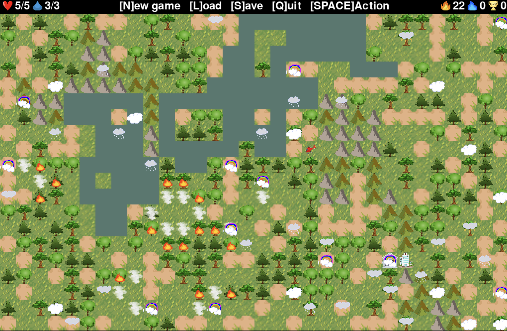

## Helicopter game

The player controls a helicopter. The goal is to score as many points as possible.

Points are earned by extinguishing burning trees. Points are lost if the player fails to extinguish a tree before it burns.

Points can be spent on healing the helicopter or upgrading its water capacity.

## Game Rules

- Extinguishing a tree earns 10 points.
- A burned tree deducts 10 points.
- Hitting a lightning cloud deducts 1 life.
- Healing costs 50 points and is available only at the hospital cell.
- Upgrades cost 100 points and are available only at the shop cell. Each subsequent upgrade increases the cost by 1.5 times.
- The player starts the game at the shop cell.
- Rain clouds extinguish fire as they pass through fire cells.
- Unextinguished trees will set neighboring trees on fire.
- Extinguished trees cannot catch fire for a while, whether by the player or rain clouds.
- The more area covered by fire, the faster it spreads.
- Smoke appears on extinguished trees. While the smoke is active, the tree cannot catch fire again.
- Smoke also appears on burned trees, but the tree won’t reappear after the smoke disappears.

Actions like collecting water, extinguishing fire, and upgrading are available only at specific cells. Press the spacebar to perform an action.

If the player loses all lives, game statistics will appear. From there, a new game can be started, or a previous game can be loaded.

In the top-right corner of the screen:
- Heart icon: lives
- Water icon: helicopter's water level
- Fire icon: number of burned trees
- Blue fire icon: number of extinguished trees
- Trophy: score

## Map Generator
- Grass covers the entire map.
- Earth fills random areas.
- The hospital and shop always spawn next to each other and have a safe area around them.
- Mountains form with mountain ranges and random cells.
- Water forms as rivers and lakes.

## Save & Load
The game saves the state of all objects and their behaviors. For example, if a tree is about to catch fire in 1 second, it will remain the same after loading.

## Graphics & Display

The game supports:
- Object animation (though content is limited, the engine supports it).
- Image scaling (zooming in and out).
- Game resolution adjustments.
- Object size changes.
- Animation speed adjustments.
- Object transparency.
- Field size adjustments.

## Technical Details
The game includes scenes, the player, objects, and behaviors with minimal interdependence. The map supports layers with priorities, each containing cells with coordinates and objects.

Rendering happens by layer priority with transparency.

Layers’ sizes are independent, allowing for smooth movement of clouds and the helicopter (although this would require more complex collision detection, which wasn't implemented).

Collisions are supported at the cell level.

## Game Settings
Game settings are stored in the `parameters.ini` file.

### Running the Game

1. Install required packages by running `install.sh`.
2. Start the game with `python main.py`.

## Author and License

**Author**: Mikhail Chuloshnikov

**License**: MIT License

This project is released under the MIT License. See the [LICENSE](LICENSE) file for more details.
